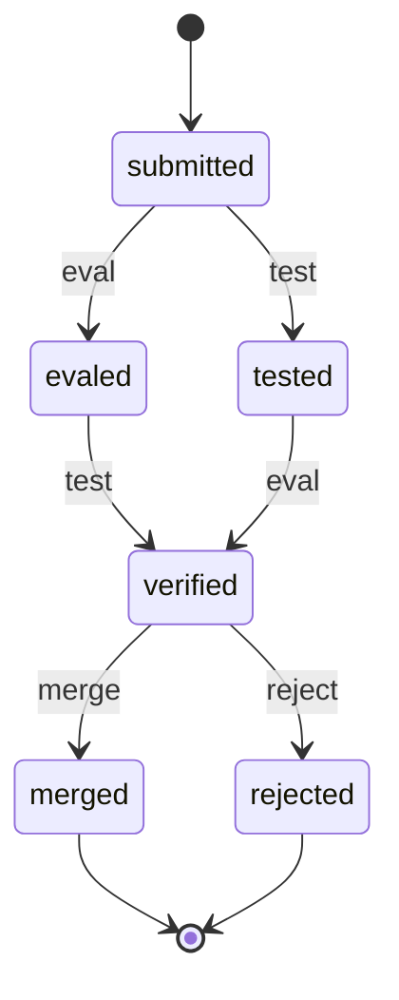

# robertluo.state-graph

A finite state machine whose **shape is a graph** — so it can be drawn and checked as one,
and a compiler can turn it into an ordinary Clojure function.

```clojure
;; from Clojars, once `clojure -T:build deploy` has run
io.github.robertluo/state-graph {:mvn/version "0.1.<n>"}

;; or as a git dependency, straight from this repository
io.github.robertluo/state-graph {:git/url "https://github.com/robertluo/state-graph"
                                 :git/sha "<a commit>"}
```

Clojure and ClojureScript: every namespace is `.cljc`, and a shape has the same fingerprint on
both hosts. Drawing to a file (`draw!`) is the JVM's alone.

## Why

A state machine written as a map literal, or as closures calling each other, hides the one
thing worth seeing: its **structure**. Which states can be reached, which can never finish,
which handler answers data the next state will not accept. Those are questions about a
graph, and they are usually answered in production.

So here the machine *is* a graph. States and events carry [malli](https://github.com/metosin/malli)
schemas, transitions are edges, and because the shape is data about a graph it can be:

- **drawn**, so a person sees the machine they described;
- **checked statically**: an unreachable state, a dead end, a trap the machine can never
  finish from, a handler whose answer the target state will not admit. All of them are
  found **without running anything**, and a check reports only what it can prove;
- **compiled into a plain function** of a state and an event, because the lifecycle of an
  instance is a reduction over its events and nothing more;
- **run concurrently where that is proven safe**: which pairs of pending events may land in
  either order is a question about the graph and the schemas, answered before anything runs.
  It is then actually taken, so the two handlers of a join cost one of them rather than both.

It **stores nothing**. Every step answers data (the event, the state, whether it fired), so
the history is yours to keep wherever you like.

It deliberately leaves some things out:
- A handler answers a patch and never raises an event.
- A guard reads the event, never the state.
- There are no orthogonal regions.
- There is no persistence and no versioning of shapes.

Each of these is a decision, and the tutorial's *What it does not do* gives the reasons.

## A scenario: reviewing a change

A submitted change must be evaluated *and* tested, in either order, before anyone may merge
or reject it:



A first draft uses one `:judge` event for both verdicts:

```clojure
(require '[robertluo.state-graph :as sg])

(def Result [:map [:ok :boolean]])

(def review
  (sg/shape
   (sg/state :submitted [:map [:code :string]] {:initial true})
   (sg/state :evaled    [:map [:code :string] [:eval Result]])
   (sg/state :tested    [:map [:code :string] [:test Result]])
   (sg/state :verified  [:map [:code :string] [:eval Result] [:test Result]])
   (sg/state :merged    [:map [:code :string]] {:final true})
   (sg/state :rejected  [:map [:code :string] [:reason :string]] {:final true})

   (sg/event :eval  [:map [:eval Result]])                 ; the event carries its result
   (sg/event :test  [:map [:test Result]])
   (sg/event :judge [:map [:verdict [:enum :merge :reject]] [:reason {:optional true} :string]]
             (fn [e] (select-keys e [:reason]))
             [:map [:reason {:optional true} :string]])   ; what the handler promises

   (sg/transition :submitted :eval  :evaled)
   (sg/transition :submitted :test  :tested)
   (sg/transition :evaled    :test  :verified)
   (sg/transition :tested    :eval  :verified)
   (sg/transition :verified  :judge :merged   {:when [:map [:verdict [:= :merge]]]})
   (sg/transition :verified  :judge :rejected {:when [:map [:verdict [:= :reject]]]})))

(sg/problems review)
;=> [{:from :verified :event :judge :to :rejected :problem :target-refuses}]
```

Nothing has run yet, and the checker has already proven that the handler's answer cannot
satisfy `:rejected`: it promises `:reason` only optionally, and a rejection must carry one.
The fix is to split the verdict into two events, each promising what its target needs.
Rebuild `review` with `:judge` and its two guarded transitions replaced by:

```clojure
(sg/event :merge  [:map])
(sg/event :reject [:map [:reason :string]])
(sg/transition :verified :merge  :merged)
(sg/transition :verified :reject :rejected)
```

and `(sg/problems review)` answers `[]`.

The machine compiles to a function, and a run is a reduction:

```clojure
(def step (sg/compile review))

(reduce step (sg/initial review {:code "(inc 1)"})
        [{:id :test :test {:ok true}} {:id :eval :eval {:ok true}} {:id :merge}])
;=> {:id :merged :code "(inc 1)"}

(step (sg/initial review {:code "(inc 1)"}) {:id :merge})
;=> {:id :submitted :code "(inc 1)"}          ; too early: ignored, not an error
```

The join needed no operator. `:verified` requires both results, so only a run that handled
both events can reach it. And the graph proves the two events may land in either order.
`sg/run` computes this itself; here it is asked directly:

```clojure
(require '[robertluo.state-graph.check :as check])

(check/commuting review)
;=> {:submitted #{#{:eval :test}}}
```

So when the handlers really run the evaluation and the tests — answering core.async channels,
so a waiting machine holds no thread — `sg/run` runs both at once. Everywhere else it applies
events strictly in order. It feeds from a channel and reports every transition:

```clojure
(require '[clojure.core.async :as a])

(def events (a/chan 4))
(def machine (sg/run review {:code "(inc 1)"} events))   ;=> {:states <chan> :done <promise-chan>}

(a/onto-chan!! events [{:id :test :test {:ok true}} {:id :eval :eval {:ok true}} {:id :merge}])

(mapv (juxt (comp :id :event) (comp :id :state)) (a/<!! (a/into [] (:states machine))))
;=> [[:test :tested] [:eval :verified] [:merge :merged]]
```

One `run` serves one machine or thousands: events are partitioned on `:instance`, and each
partition is a machine of its own.

## Prior art

- **Harel statecharts** (1987), **UML state machines** and **SCXML** define most of the
  vocabulary used here: completion transitions, nested states, guards. They also have
  orthogonal regions, which this library leaves out on purpose.
- **[XState](https://stately.ai/docs/xstate)** (JavaScript),
  **[clj-statecharts](https://github.com/lucywang000/clj-statecharts)** and
  **[fulcrologic/statecharts](https://github.com/fulcrologic/statecharts)** (Clojure and
  ClojureScript) are full statechart implementations: parallel states, actions, delayed
  events. They answer "how does this machine behave?". This library asks first "what can be
  proven about this machine before it runs?", and gives up expressiveness for it.
- **[tilakone](https://github.com/metosin/tilakone)** and
  **[reduce-fsm](https://github.com/cdorrat/reduce-fsm)** are small Clojure FSM libraries.
  reduce-fsm also treats a machine as a reduction and can draw it. What this library adds is
  schemas on every state and event, and the static checks those make possible.
- **Workflow engines** such as Temporal and AWS Step Functions run steps concurrently and
  persist every run. This library persists nothing, and runs two events of one machine at
  once only where the graph proves the order cannot be observed.
- The concurrency proof is textbook: a **closing diamond** (confluence) over the graph, plus
  **Bernstein's conditions** on what each handler reads and writes. As far as we know, no
  other FSM library proves concurrency statically.

## Key API

`robertluo.state-graph` is the one namespace an application needs:

| | |
|---|---|
| `state` `event` `transition` `shape` | build a machine; a state may nest a machine, and a transition may carry a guard |
| `problems` `draw!` `dot` `fingerprint` | check it, draw it, and name it with a stable id |
| `path` `paths` `components` `topsort` `dag?` `isomorphism` `subgraph?` `out-degree` `in-degree` | walk it as a graph |
| `compile` `initial` | the reduction: `(reduce (compile sh) (initial sh data) events)` |
| `run` | the stream: a channel of events in, a channel of transitions out |
| `step` `drive` | the crank: a machine that finds its own events through each event's `:report` |

The namespaces underneath (`.shapes`, `.compiler`, `.check`, `.crank`, `.async`, `.explore`,
`.graph`) can be required, but their names are not API. Every check the library has lives
in `.check`, and `.explore` covers a graph by *running* it.

**[`notebook/tutorial.clj`](notebook/tutorial.clj)** works through all of it in order, and
every example in it runs when it renders (`clojure -X:notebook` writes
`docs/tutorial.html`). It covers:
- nesting, completion and outcomes;
- guards, views, reports and the crank;
- combines and fan-out;
- the fingerprint and walking the graph;
- what the library deliberately does not do.

Every var's docstring and `:knowledge` metadata records why it is the way it is.

## Development

`devenv test` runs everything: the JVM suites, the ClojureScript suite on node, and the jar.
Without devenv, the suites need a JDK, the Clojure CLI, graphviz (the drawing tests render
for real) and node on the `PATH`.
[AGENTS.md](AGENTS.md) has the commands and the workflow. MIT licence.
